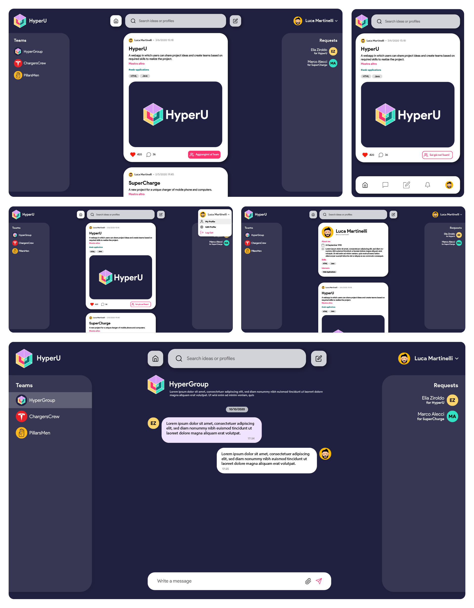

======

# Visit our website [hyperu.space](https://hyperu.space)

A web app in which users can share project ideas and create teams based on required skills to realize the project.
Every user can customize his profile inserting his biography and skills.
Users can like and comment other users' ideas and even ask to be part of their team.
Every team has its own page where people can talk about the project or share files and links.
Those projects and their teams can eventually end up being start-ups.

The database documentation is available [here](global-resources/HyperU%20-%20Database%20Documentation.pdf).

The full REST API Documentation is available [here](https://hyperu.space/api/documentation.html).

**N.B. All the images used in the PDF Report can be found in the global-resources folder.**

---

# Mockup

## User Interface
Below are displayed, in order

* The home page the user sees after login

* A mobile optimized version of the same page

* An alternative version of the Home Page, with the profile's dropdown menu visible

* The Profile Page of a user

* The Chat Page of a Team



## JSON

The REST API response in JSON format. A possible template of a response would be the following one. If "isError" is true, the "errorCode" would be different from null.

```json
{
  "message": {
    "message": "The result message",
    "isError": true,
    "errorCode": -100
  },
  "data": {
    
  }
}
```

## How to test REST API

Since only back-end was developed up to now, to try different the Rest API you need to use CURL.

```bash
curl -d "username=luca.martinelli.09&password=martino"
     -X POST "https://hyperu.space/api/user/login" 
     --cookie "cookie.txt" --cookie-jar "cookie.txt" 
     --location -v
```
This user is an administrator and so can be used for a lot of different operation.

To try to access different resources, you can also use this [website](https://petstore.swagger.io/?url=https://hyperu.space/api/openapi.yaml).

